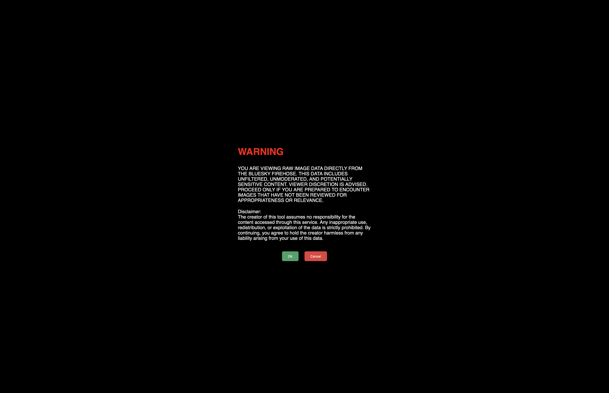

# Ludovision

**Ludovision** is a lightweight, client-side tool that streams and displays real-time images uploaded to the [Bluesky](https://bsky.app) social media platform via its firehose. Designed as a proof of concept, Ludovision highlights the fragility of privacy through obscurity and serves as a reminder of the digital footprints we leave behind online.

## 🚀 Features

- **Real-Time Streaming**: Scroll infinitely through every image posted to Bluesky in real-time.
- **Interactive Viewer**: Click on an image to view a larger version and access the uploader's profile.
- **Full Gallery View**: Explore the image owner's entire account gallery. *(Requires a Bluesky auth token; see instructions below.)*
- **No Server Required**: Runs entirely client-side for full transparency—no data is collected or transmitted.
- **No External Libraries**: No remote code loading. Privacy is respected, even in this experiment.
- **Zero Tracking**: The tool operates without any tracking mechanisms, ensuring user anonymity.

## 🛠️ How It Works

Ludovision connects directly to the Bluesky firehose API and processes public image data to display it in a simple, scrollable interface. It leverages minimal JavaScript to provide functionality without requiring any external dependencies or backend server.

### The Name
The project is named **Ludovision** as a nod to *A Clockwork Orange*'s Ludovico Technique—a scene where the protagonist is subjected to aversion therapy. Similarly, scrolling through this unfiltered firehose of images serves as a vivid reminder of how public and permanent our online actions are.

## 🌟 Purpose

Ludovision was built to:
- Demonstrate how easy it is to aggregate and parse public data.
- Raise awareness of the digital footprints we leave behind on social platforms.
- Explore the concept of privacy through obscurity and its inherent fragility.

**This project is an experiment and is not intended for production use or deployment in a live environment.**

## ⚠️ Privacy Note

Ludovision is a tool for exploring publicly available data and does not:
- Store any data locally or remotely.
- Track user activity in any form.
- Interact with any servers by default other than the Bluesky firehose
- Ludovision will accept an auth token for Gallery view. This will identify your activity with Bluesky servers when using Gallery view only. Use caution.

## 🧑‍💻 Getting Started

To use Ludovision locally, clone the repository and open the `index.html` file in your browser.
- ‼️ I **HIGHLY** recommend opening this file in Private Browsing Mode or Incognito.

### Prerequisites
- A modern browser (tested on Chrome, Firefox, and Safari).
- Access to the Bluesky firehose API.
- (Optional) A Bluesky auth pair for enabling the full gallery view.

### Installation

1. Clone this repository:
   ```bash
   git clone https://github.com/msitarzewski/ludovision.git
   ```
2. Open the project folder:
   ```bash
   cd ludovision
   ```
3. Launch the tool by opening `index.html` in your browser:
   ```bash
   open index.html
   ```
4. Optional:
   ```bash
   cp settings-dist.js settings.js
   ```
   Modify default image size, token, etc.

### Setting Up the Full Gallery View

To enable the full gallery view of an image owner's account:
1. Locate the `bsky_identifier` and `bsky_appPassword` variablea in the settings.js file (see above).
2. Replace null with your Bluesky identifier and App Password.
   ```javascript
   const bsky_identifier = null;
   const bsky_appPassword = null;
   ```
   > *Note: see https://bsky.app/settings/app-passwords for more details*

3. Save the changes and reload the file in your browser.

## Content Warning Modal

- `OK` to load the feed  
- `CANCEL` to be redirected to Bluesky  
> *Note: You can override this warning in settings.js*

## The Feed


The feed begins to load automatically after either the Warning modal is acknowledged, or the pages is freshed when overridden.

Images stream in in real time from the firehose. We use a defer technique to show only the images you've scrolled to or that have already appeared in the viewport. This saves a ton of bandwidth and makes the gallery view snappy.

You can adjust the image preview size in the header from between 32px and 512px on the fly. You can set a default value in settings.js, otherwise it's 128px.

The header also shows status. Today that's simply the number of images that have been loaded from into the feed.

Click any image to open the Feed Image modal. 

## Feed Image Modal

The selected image is scaled to fit the current viewport.
`View Profile` to open Bluesky to the user's profile page
If Bluesky authentication is enabled, you can also click `View Gallery` to see the rest of the images in the user's profile.
*Note: You can use the space bar to launch the Gallery View. ESC will close the current modal*

## 🎯 Future Goals

- Enhance the interface for better usability.
- Add filters to categorize or exclude specific content.
- Expand support for additional social media APIs (as appropriate).
- Raise awareness about digital privacy and security through further experiments.

## 🛡️ Disclaimer

This project is intended for educational and awareness purposes only. Respect platform terms of service and user privacy when using or replicating this project. 

## 📝 License

This project is licensed under the [Unlicense](LICENSE).
