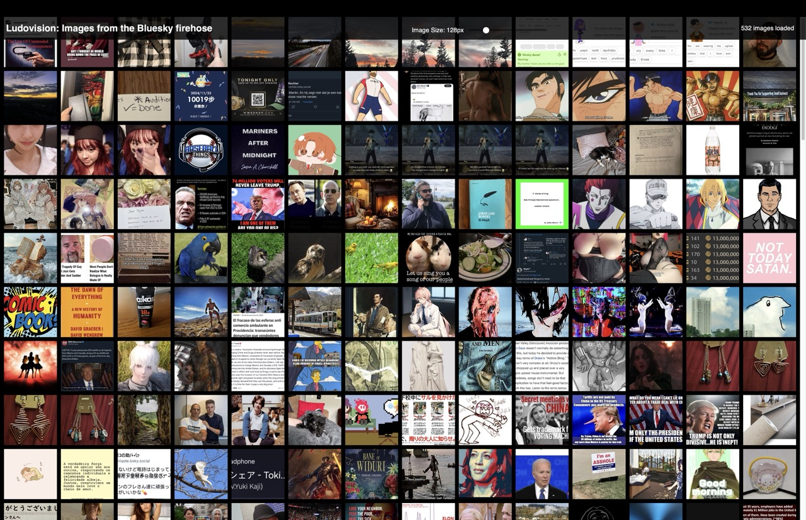
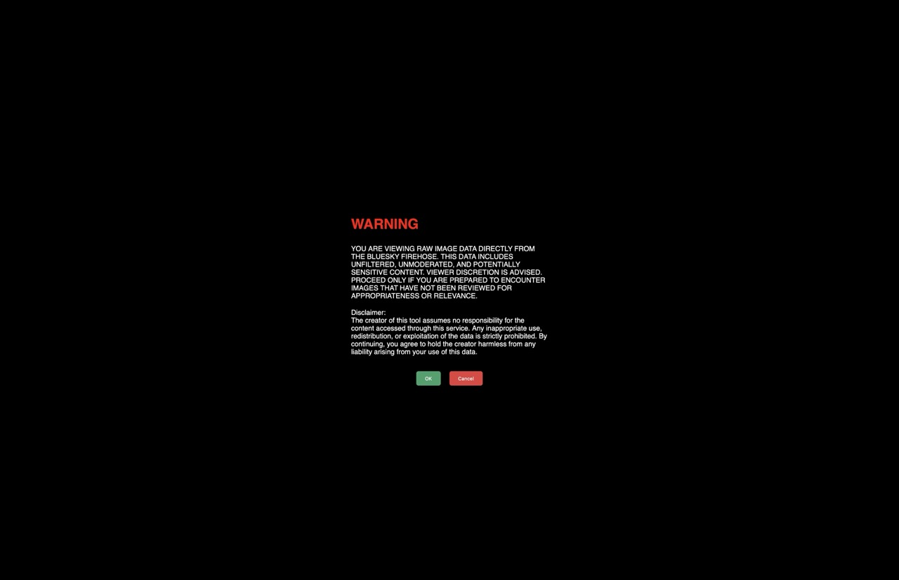
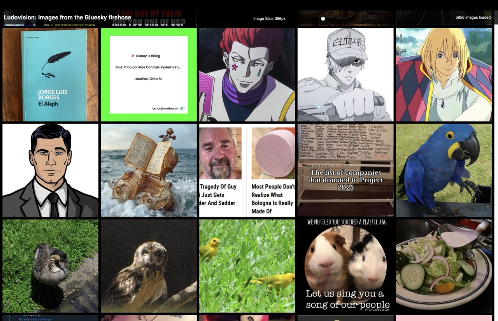
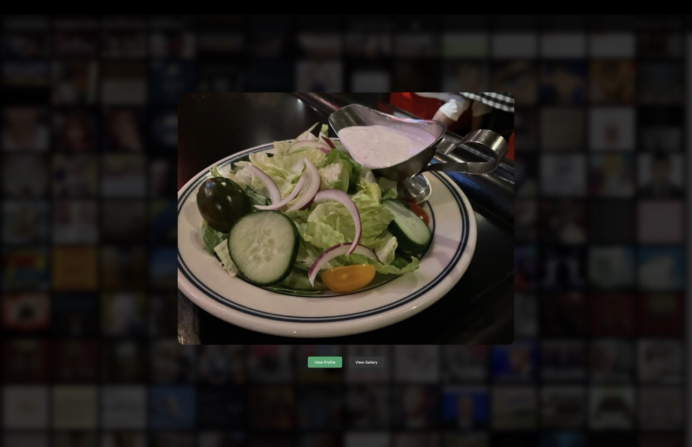
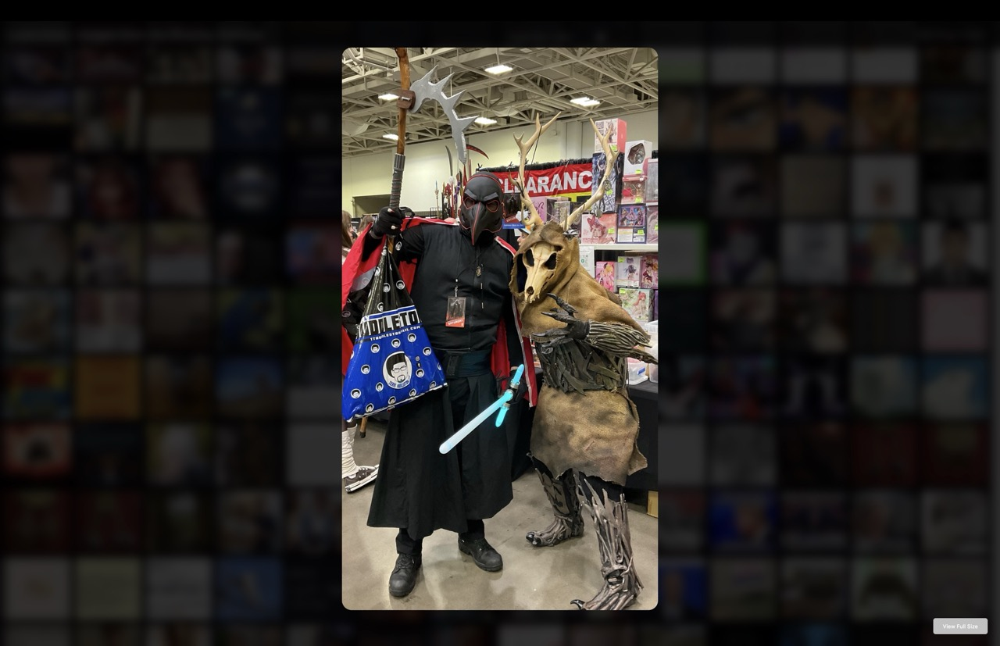
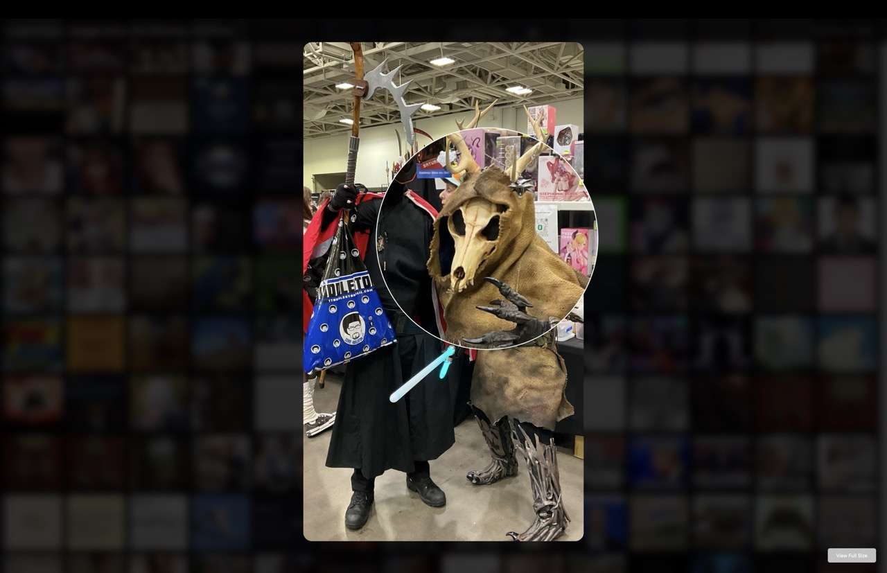

# Ludovision

**Ludovision** is a lightweight, client-side tool that streams and displays real-time images uploaded to the [Bluesky](https://bsky.app) social media platform via its firehose. Designed as a proof of concept, Ludovision highlights the fragility of privacy through obscurity and serves as a reminder of the digital footprints we leave behind online.

## 🚀 Features

- **Real-Time Streaming**: Scroll infinitely through images and videos uploaded to Bluesky in real-time.
- **Video Support**: Watch videos directly in the feed and gallery with HTML5 native controls.
- **Interactive Viewer**: Click any image or video to view it in a larger modal with profile access.
- **Enhanced Gallery View**: Browse a user's complete media collection with automatic pagination and continuous navigation.
- **Media Type Filtering**: Toggle images and videos independently to customize your viewing experience.
- **Lazy Loading**: Media loads only when scrolled into view, optimizing bandwidth and performance.
- **Intelligent Navigation**: When reaching the end of loaded content, more is automatically fetched.
- **Media Deduplication**: Smart filtering prevents duplicate content from appearing in galleries.
- **Error Recovery**: User-friendly error handling with automatic retries and clear feedback.
- **No Server Required**: Runs entirely client-side for full transparency.
- **Zero Tracking**: No data collection or analytics of any kind.
- **No External Dependencies**: Self-contained with no remote code loading.

## 🛠️ How It Works

Ludovision connects directly to the Bluesky firehose API and processes public image and video data to display it in a simple, scrollable interface. Videos are detected from `app.bsky.embed.video` embeds and streamed using HLS (HTTP Live Streaming) with native HTML5 video players. It leverages minimal JavaScript to provide functionality without requiring any external dependencies or backend server.

### The Name
The project is named **Ludovision** as a nod to *A Clockwork Orange*'s Ludovico Technique—a scene where the protagonist is subjected to aversion therapy. Similarly, scrolling through this unfiltered firehose of images serves as a vivid reminder of how public and permanent our online actions are.

## 🌟 Purpose

Ludovision was built to:
- Demonstrate how easy it is to aggregate and parse public data.
- Raise awareness of the digital footprints we leave behind on social platforms.
- Explore the concept of privacy through obscurity and its inherent fragility.

**This project is an experiment and is not intended for production use or deployment in a live environment.**

## ⚠️ Privacy Note

Ludovision is a tool for exploring publicly available data and does not:
- Store any data locally or remotely.
- Track user activity in any form.
- Interact with any servers by default other than the Bluesky firehose
- Ludovision will accept an auth token for Gallery view. This will identify your activity with Bluesky servers when using Gallery view only. Use caution.

## 🧑‍💻 Getting Started

To use Ludovision locally, clone the repository and open the `index.html` file in your browser.
- ‼️ I **HIGHLY** recommend opening this file in Private Browsing Mode or Incognito.

### Prerequisites
- A modern browser (tested on Chrome, Firefox, and Safari).
- Access to the Bluesky firehose API.
- (Optional) A Bluesky auth pair for enabling the full gallery view.

### Installation

**QUICK START: No installation is required. Download the zip, decompress, and open index.html (preferrably in a private window). That's it.**

1. Clone this repository:
   ```bash
   git clone https://github.com/msitarzewski/ludovision.git
   ```
2. Open the project folder:
   ```bash
   cd ludovision
   ```
3. Launch the tool by opening `index.html` in your browser:
   ```bash
   open index.html
   ```
4. Optional:
   ```bash
   cp settings-dist.js settings.js
   ```
   Modify default image size, token, etc.

### Setting Up the Full Gallery View

To enable the full gallery view of an image owner's account:
1. Locate the `bsky_identifier` and `bsky_appPassword` variables in the settings.js file (see above).
2. Replace null with your Bluesky identifier and App Password.
   ```javascript
   const bsky_identifier = null;
   const bsky_appPassword = null;
   ```
   > *Note: see https://bsky.app/settings/app-passwords for more details*

3. Save the changes and reload the file in your browser.

## Content Warning Modal

`OK` to load the feed<br>
`CANCEL` to be redirected to Bluesky<br>
Note: You can override this warning in settings.js

## The Feed


The feed begins to load automatically after either the Warning modal is acknowledged, or the pages is freshed when overridden.

Images and videos stream in real time from the firehose. Videos display with a play button overlay. We use a lazy loading technique to show only the media you've scrolled to or that have already appeared in the viewport. This saves a ton of bandwidth and makes the experience snappy.

You can adjust the media preview size in the header from between 32px and 512px on the fly. You can set a default value in settings.js, otherwise it's 128px.

You can also filter media types in the settings panel - toggle images and videos on/off independently.

The header also shows status. Today that's simply the number of media items that have been loaded into the feed.

Click any image or video to open the Feed modal. 

## Feed Media Modal

The selected image is scaled to fit the current viewport. Videos play with HTML5 native controls, allowing you to play/pause, seek, adjust volume, and toggle fullscreen.

Videos auto-play when the modal opens. You can control whether they start muted in the settings panel (default: muted).

`View Profile` to open Bluesky to the user's profile page

If Bluesky authentication is enabled, you can also click `View Gallery` to see the rest of the media in the user's profile.

> *Note: You can use the space bar to launch the Gallery View. ESC will close the current modal*

## Gallery View

All media (images and videos) are loaded from the current media owner's account. They're presented in a grid at 128px/128px. Videos display with a play button icon overlay.

Click any image or video to view.

`Close` (or ESC) to close the modal

`View Profile` to open Bluesky to the user's profile page

> *Note: You can use the space bar to launch the Gallery Media Modal with the first item. ESC will close the current modal.*

## Gallery Media View


The selected gallery item is displayed within the current viewport. Videos play with HTML5 native controls. Images can be viewed full-size by tapping space or clicking `View Full Image` if the image is scaled. A magnifying area will follow the cursor for zoomed images. This can be disabled in settings.js.<br>

`L/R Arrows and W/D` keys navigate the media while in Gallery Media Mode. When you reach the end of loaded items, Ludovision automatically fetches more from the user's profile. If no more media is available, navigation loops back to the first item.

`Close` (or ESC) to close the modal

## Enhanced Gallery Features

### Continuous Navigation
When browsing through a gallery with arrow keys, Ludovision automatically loads more media when you reach the end of the currently loaded set. If no more content is available from the user's profile, navigation will loop back to the first item.

### Lazy Loading
Media is loaded only when it's about to enter your viewport, saving bandwidth and improving performance. Videos use `preload="none"` to minimize data usage.

### Media Deduplication
The gallery automatically filters out duplicate content, ensuring you don't see the same images or videos multiple times.

### Video Performance
Videos automatically pause when they leave the viewport to conserve resources. When you close a modal or navigate away from a video, it's properly stopped and unloaded to free memory.

### Media Type Filtering
Toggle images and videos on/off independently in the settings panel. Choose to view only images, only videos, or both.

### Improved Loading Experience
A subtle loading indicator appears when fetching more content, replacing the full-screen dimming effect for a less intrusive experience.

### Error Handling
If an error occurs while loading media, you'll see a user-friendly message with the option to retry.

## 🎯 Future Goals

- Enhance the interface for better usability.
- Add filters to categorize or exclude specific content.
- Expand support for additional social media APIs (as appropriate).
- Raise awareness about digital privacy and security through further experiments.

## 🛡️ Disclaimer

This project is intended for educational and awareness purposes only. Respect platform terms of service and user privacy when using or replicating this project. 

## 📝 License

This project is licensed under the [Unlicense](LICENSE).
